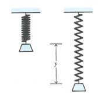

```{r setup, include=FALSE}
knitr::opts_chunk$set(echo = TRUE)

```
**Due:** 5pm Tuesday 9th August 2016.

If you have any questions about this assignment, please see or email your lecturer for this course, Dr Daniel Sutherland <Daniel.Sutherland@newcastle.edu.au>.

***
####Questions which review material from Week 1:

1. If a mass m is placed at the end of a spring, and if the mass is pulled downwards and released, the mass-spring system will begin to oscillate. The displacement $y$ of the mass from its resting position is given by a function of the form. 
$$ y(t) = c_1 cos(\omega t) + c_2 sin(\omega t); $$ where $\omega$ is a constant that depends on the spring and the mass. (See diagram below) <center>  </center>

    It can be shown that the set of all functions described in Equation (1) (with $\omega$ fixed and $c_1, c_2$ arbitrary real scalars) is a vector space. Don't verify every defining property of a vector space, but pick any two of the following properties and show that they are satisfied by the set of all functions described in Equation (1).
    * Addition of vectors is associative.
    * Multiplication of a vector by a scalar is associative.
    * There exists an additive identity.
    
    \hfill
    
    **Answer** Let $Y(\mathbb{R})$ equal the set of all functions decribed by $y(t)$ over the field $\mathbb{R}$. Firstly, setting $c_1 = c_2 = 0 \implies \vec{0} \in Y$. Next: $$\forall \alpha, \beta, \gamma, \delta, \omega \in \mathbb{R}\left(\exists \vec{u_t} := \alpha \cos(\omega t) + \beta \sin(\omega t) \text{ and } \vec{v_t} := \gamma \cos(\omega t) + \delta \sin(\omega t)\right)$$ such that 
    $$\begin{aligned}\vec{w_t}&= \vec{u_t} + \vec{v_t} \\ &= \alpha \cos(\omega t) + \beta \sin(\omega t) + \gamma \cos(\omega t) + \delta \sin(\omega t) \\ &= (\alpha + \gamma) \cos(\omega t) + (\beta + \gamma) \sin(\omega t) \\ & \in Y \end{aligned}$$ Therefore, the addition of vectors is associative.

***

2.	Let $U$ and $V$ be subspaces of some vector space $W$ over a field $\mathbb{F}$. Prove that $U \cap V$ is also a subspace of $W$ .

    *Hint: think about what kind of vectors are in $U \cap V$.*
    
    \hfill
    
    **Answer:** If $U$ and $V$ are both subspaces of a vector space $W$ over a field $\mathbb{F}$, then the must each contain $\vec{0}$. Therefore, $\vec{0} \in U \cap V$. Next, suppose that: $$\exists \vec{u},\vec{v} \in U \cap V ( \exists\vec{w} := \vec{u} + \vec{v}: \vec{w} \notin U \cap V).$$ Because it is stated that $U$ is a subpace, it must be closed under addition, by definition. Therefore: $$\forall \vec{u},\vec{v} \in U \cap V \implies \vec{u},\vec{v} \in U : \exists\vec{w} := \vec{u} + \vec{v} \in U \implies \vec{w} \notin V.$$ However, because $V$ is also a subspace, we get: $$\forall \vec{u},\vec{v} \in U \cap V \implies \vec{u},\vec{v} \in V: \exists\vec{w} := \vec{u} + \vec{v} \in V \implies \vec{w} \notin U,$$ which is a contradiction. Therefore, we conclude that $\vec{w} \in U \cap V$ and that $U \cap V$ is closed under addition. 
    
    It is trivial to extend this proof by contradiction to show that $U \cap V$ is closed under scalar multiplication $\forall \lambda \in \mathbb{F}$. Therefore, $U \cap W$ is a subspace of $W$.

***
####Introductory level question relating to Week 2:

3.	Consider the list of vectors $B = ((1, 0, 0), (1, 1, 0), (1, 1, 1))$ from the vector space $\mathbb{R}^3$.

    (a)	Write the vector $(9, 8, 16)$ as a linear combination of the vectors in $B$.
    (b)	Does the list of vectors $B$ span $\mathbb{R}^3$? Explain why/why not.
    
    \hfill
    
    **Answer:** The vector $\vec{t} \in span(B): \vec{t} = (9,8,16)$ can be defined as a combination of three vectors $\vec{u},\vec{v},\vec{w},\in B: \vec{u} = (1,0,0), \vec{v} = (1,1,0) \text{ and } \vec{w} = (1,1,1)$ by the relationship $\vec{t} = (16\cdot \vec{w}) - (8 \cdot \vec{v}) + (1 \cdot \vec{u})$.
    
    The list of vectors in $B$ - defined above - do span $\mathbb{R}^3$ because we can define a relationship: $$\begin{aligned} &\forall \vec{t} \in \mathbb{R}^3: \quad \vec{t} = (\alpha,\beta,\gamma) &\alpha,\beta,\gamma \in \mathbb{F} \\ \implies &\vec{t} := (\gamma)\cdot\vec{w} + (\beta-\gamma)\cdot\vec{v} + (\alpha-\beta)\cdot\vec{u} &\vec{u},\vec{v},\vec{w},\in B \end{aligned}$$ Therefore, any vector in $\mathbb{R}^3$ can be expressed in terms of the list of vectors in $B$, which implies that $B$ spans $\mathbb{R}^3$.
    

***
####Extension question - will not be marked, just for interest!

4.	Let $\mathbb{Q}$, with the usual addition and multiplication, be the field of rational numbers. Show that $\mathbb{R}$ is a vector space over the field $\mathbb{Q}$. Is $\mathbb{R}$ a finite-dimensional rational vector space?

***
###Submitting your assignment (due 5pm Tuesday 9th August 2016)

*Submit your assignment in hardcopy in your Demonstrator's pigeonhole in the Assignment boxes near the Maths Clinic, on the opposite wall to the Maths Clinic, left of the door to V109. We also ask that you scan your written work and submit it on the MATH2320 UoNline/Blackboard site as a backup and proof of submission, not as a substitute. __Note that we still require the hardcopy submitted in the Assignment Box for your Demonstrator to mark, even if you have submitted a backup on Blackboard.__*
